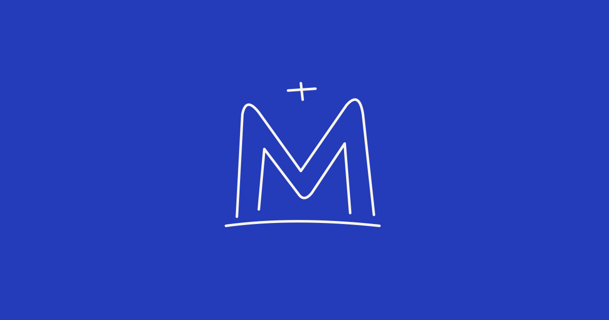

ECV LILLE · CREATIVE DEVELOPMENT

# My Creative Museum

Un musée en ligne, pensé comme une expérience visuelle.

**[Visiter le musée ↗](https://my-creative-museum.vercel.app)**

 

---

### L'idée

J'ai réalisé ce projet dans le cadre du cours **Framework JS à l'ECV Lille**, avec **Antoine Delcourte**. Le sujet de départ était de créer un site de musée avec **Next.js**.

J'ai choisi de me fixer un objectif supplémentaire : en faire un site **« awwwardable »**, avec une direction artistique soignée et une vraie attention portée aux interactions. J'ai rapidement pris plaisir à explorer le creative development, à travailler la typographie, le mouvement et la mise en scène des œuvres. L'ambition est de **le proposer à Awwwards par la suite**, si le résultat s'y prête.

### Pourquoi Next.js ?

J'aime beaucoup Next.js, tout simplement parce qu'il s'inscrit dans l'environnement **React**, que j'apprécie utiliser. Ce cours m'a aussi permis de reprendre les bases et de retrouver de bonnes pratiques que j'avais un peu oubliées. C'était une bonne occasion de les remettre en application sur un projet où je pouvais aussi soigner la direction artistique.

### Sous le capot

**Next.js & React** pour l'application, **Tailwind CSS** pour les styles, **GSAP & Lenis** pour les animations et le défilement, **Three.js & WebGL** pour les effets visuels. Côté données : **Neon PostgreSQL**, **Drizzle ORM** et **Better Auth** pour l'authentification.

